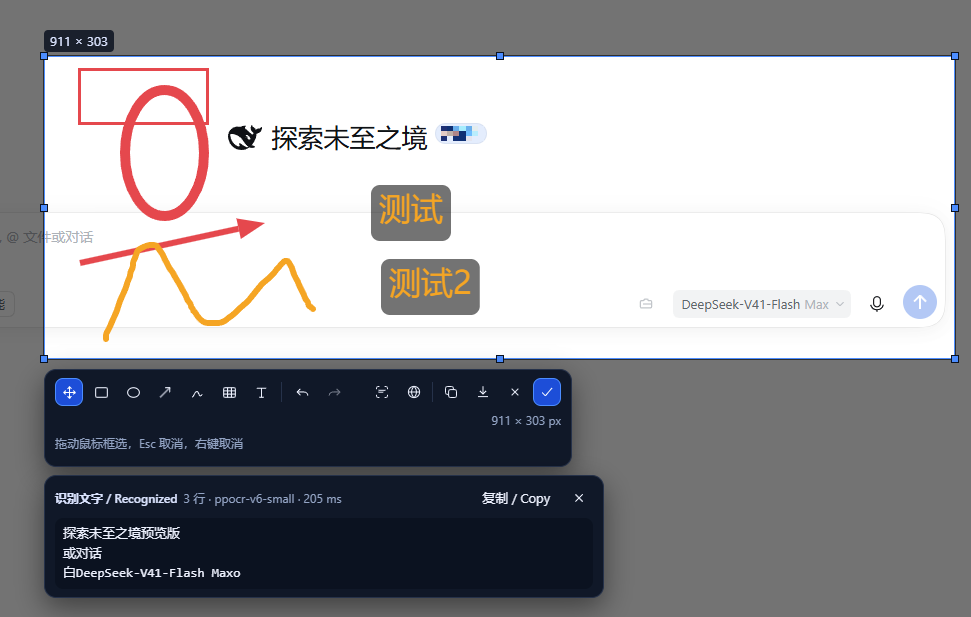
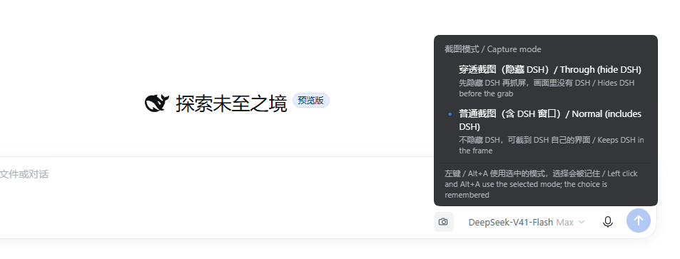
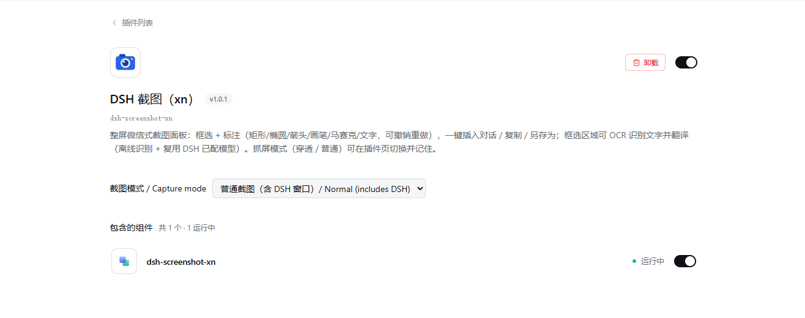

# dsh-screenshot-xn（DSH 截图）

**简体中文** ｜ [English](README.en.md)

给 DSH Desktop 加一个截图插件：点输入框旁的按钮（或按 `Alt+A`）→ 屏幕整体变暗、出现**独立的全屏截图面板**（微信式：覆盖整屏含任务栏，DSH 窗口先被临时隐藏，所以你看到的就是真实桌面）→ 框选并标注（矩形／椭圆／箭头／画笔／马赛克／文字，可撤销重做）→ 点「插入对话／复制／另存为」，面板关闭，结果落到 DSH 里。

同一块选区还能**识别文字**和**翻译**：工具栏最左边的「识别文字」把框选区域读成可复制、可编辑的文本（默认引擎 PP-OCRv6，在本机跑，**离线、无密钥**；模型没就绪时回落 Windows 自带 OCR），「翻译」再把它翻成 9 种语言的任意一种（用**你在 DSH 里已经配好的模型**，默认零配置）；原文与译文都落在同一张结果卡片上，各自带「复制 / Copy」。

## 效果预览

下面三张都是真机实拍（本机 3440×1440 主屏），没有摆拍、没有合成：

**① 框选 + 标注 + 区域识别（面板）** —— 拖出选区后工具栏出现（第一行最左边是「识别文字」与「翻译」两个按钮），红框/椭圆、黄色箭头与手绘曲线、两个文字标注都画在选区里；下方是「识别文字」的结果卡片（引擎 `ppocr-v6-small`、耗时、行数，行尾「复制 / Copy」）。识别读的是屏幕上**原图**：画在文字上的红框不会进识别结果。



**② 抓屏模式（右键截图按钮）** —— 「穿透截图（隐藏 DSH）」与「普通截图（含 DSH 窗口）」，当前选中的那条前面是蓝点；选择会被记住，左键 / `Alt+A` 都用它。

**③ DSH 插件页里的同一项配置** —— `插件 → DSH 截图（xn）`，下拉框写的是同一份 `captureMode`，改完立即生效、重启保留。

<table>
<tr>
<td width="50%"></td>
<td width="50%"></td>
</tr>
<tr>
<td align="center">② 右键菜单切换模式</td>
<td align="center">③ 插件页切换模式（同一份配置）</td>
</tr>
</table>

> **插件名**：`dsh-screenshot-xn`（2026-09-30 由 `dsh-screenshot` 改名，用于和市面上同名/近名的截屏插件区分）。
> 目录仍是 `E:\dshplugins\dsh-screenshot`；改的只是**包名与 cordis 行 id/name**（插件列表与插件页显示的就是它）。
> **保持不变**（都是冻结契约，改名不碰）：路由 `/api/dsh-screenshot/*`、度量头 `X-DSH-Screenshot`、
> 槽位条目 id `dsh-screenshot.button` / `dsh-screenshot.overlay`、DOM 标记 `data-dsh-screenshot-ui`。
> 同名迁移已做：活动 profile 的注册（依赖键 / bundles / 行 id+name）、`captureMode` 持久化覆盖、node_modules 链接。

- 代码产地：`E:\dshplugins\dsh-screenshot`
- 运行时：DSH Desktop（Windows）。宿主半依赖 Windows PowerShell 5.1 + .NET `System.Drawing`（系统自带，无第三方原生依赖）；独立面板用系统浏览器（Edge / Chrome）的 kiosk 窗口承载；客户端半是纯浏览器代码。
- 验证过的版本：**DSH 0.1.7-rc.2**、活动 profile `comfyui`、node v24.14.1、Windows PowerShell 5.1.26100.9444（R-06：DSH 升级后请重新目视核对槽位与路由）。

> **改完代码要重启 DSH Desktop**：宿主半（`index.js` 的路由、kiosk 拉起、退出清理）只在 DSH 进程启动时加载。若宿主还是旧版，点截图会看到「独立截图面板不可用…（overlay.start http 404）」并**自动回退**到下面「局限」里说的 DSH 内覆盖层流程——功能不缺失，但那不是本版本的主路径。

---

## 安装

安装由官方 `plugin_manager` 工具负责，**不要**手写 profile 的 `package.json` / `cordis.patch.yml`，也不要在 profile 目录执行 pnpm。

1. 用 `plugin_manager` 的 `install_bundle` 指向本目录的绝对路径：

   ```
   plugin_manager
     action: install_bundle
     target: E:\dshplugins\dsh-screenshot
   ```

   该动作会调用 pnpm 把本地目录装进活动 profile，并按 `package.json` 的 `dsh.bundle.patch` 应用 `cordis.patch.yml`。

2. **需要批准**：安装动作（以及可能的构建脚本）会请求用户批准；未批准时安装不会生效。若返回体里出现 `pendingBuilds`，本插件不需要任何构建脚本，不要为它授权。

3. 记录 `install_bundle` 返回的 `application` 字段（DoD A-7）：

   | `application` | 含义与后续动作 |
   | --- | --- |
   | `applied` | 当场生效（客户端半热加载）；宿主半的路由仍以进程启动时加载的那份为准，改过 `index.js` 请重启 DSH |
   | `restart-required` | 需要重启 DSH Desktop 后再核对 |
   | `overridden` | 有更高优先级的层覆盖了本行，检查 profile 的 patch 层 |
   | `failed` | 看返回体的 `warnings`/错误原因；常见原因是 `target` 不是本目录的绝对路径 |

   > **前置开关（每一台新机器都要看）：整屏面板需要 DSH Desktop 放行"普通浏览器访问"。**
   > 主路径的「独立整屏截图面板」是由系统浏览器（Edge / Chrome 的 kiosk 窗口）去加载
   > `http://127.0.0.1:<DSH 端口>/api/dsh-screenshot/overlay/page` 实现的；而 DSH Desktop 的 webServer
   > **默认只放行带渲染器令牌的请求** —— 实测 DSH Desktop 2.0.15 里 `lib/webserver.js` 的 `permits()`
   > 每次请求现查 `desktopBrowserAccess`，`lib/desktop-browser-access-*.js` 的 `decideDesktopBrowserAccess`
   > 在 `ordinaryBrowserEnabled` 为 `false`（=`openBrowser` 的默认值）时对一切非 Electron 渲染器请求返回
   > `denied`，于是响应是 `403` + 正文就 9 个字节 `forbidden`。
   > **在默认设置下，kiosk 窗口拿到的就是这个 403**：插件在抓屏**之前**就会预检出来（`desktop-browser-access-denied`），
   > 给出可见提示，并**自动回退**到「DSH 内覆盖层」流程（DSH 窗口里先出一张冻结帧，再在这张图上框选）。
   > 这不是故障，也不是装的版本不对 —— 功能不缺失，但那不是主路径。
   >
   > 打开方式（任选其一，改完**重启 DSH Desktop**；host 半只在进程启动时加载）：
   > - **界面**：DSH Desktop **设置 → 「浏览器与局域网」→ 勾选「允许在浏览器中打开」**。该开关只在窗口模式为「兼容模式」时可用，否则是灰的并写着「浏览器访问仅在兼容模式下可用；如需开启，请先选择兼容模式。」；
   > - **配置**：往当前 profile 的 `cordis.patch.yml` 里加下面这一行（本机就是靠它验证的，`case` 与缩进照抄）：
   >
   >   ```yaml
   >   - id: desktop-shell
   >     name: dsh-plugin-desktop
   >     config:
   >       mode: compatibility
   >       openBrowser: true
   >       networkExposure: loopback
   >   ```
   >
   > 不打开也能用：整屏面板那一套每次都走回退路径，标注、识别、翻译、插入、复制、另存为的行为完全一样。

4. 自检清单（安装 + 重启后 30 秒内可做完）：
   - 打开任意普通会话，输入框动作区出现截图按钮，悬停显示"截图 / Screenshot"；
   - 点按钮：DSH 窗口一闪（被临时隐藏后恢复），随后**整个屏幕**被截图面板盖住（含任务栏）。若看到的是"DSH 窗口里出现一张冻结帧"，说明上面那条前置开关还没开（已知回退，不是故障，对照下一条）；
   - 框选一块区域 → 工具栏出现 → 点「复制」→ 面板关闭、回 DSH，出现成功提示；
   - 在面板里按 Esc（或右键、或框太小）→ 面板关闭，DSH 里的草稿文字与附件与进入前完全一致；
   - 把 Edge / Chrome 都临时改名（模拟"没有浏览器"）→ 点截图出现「未找到可用的浏览器…」并**照样能截**（回退 DSH 内覆盖层）。

---

## 配置

配置写在 `cordis.patch.yml` 那一行的 `config:` 里（`config: {}` 即全部使用默认值）。所有键都是可选的，未知键会被忽略。
其中 `captureMode` 比较特别：它由 `Config` schema 声明为 **volatile** 字段，并由 **client 半边贡献到 DSH 插件页的 `plugins.bundle.config`**（`key` = 包名 `dsh-screenshot`）—— 所以它会以「截图模式 / Capture mode」下拉框出现在 `插件 → dsh-screenshot` 那一页，和语音输入插件的「识别服务 / 识别语言」同一套机制。你在那里（或右键菜单里）改的值由 DSH 写进**当前 profile** 的 `cordis.patch.yml`（不是本插件的 bundle patch），改完立即生效、重启保留。手写 `config: { captureMode: normal }` 同样有效。
> 注：DSH 插件页只在**有客户端贡献**时才渲染配置区（`renderSlot("plugins.bundle.config", …, { entryKey: pkg.name })` 外面那层 `configured ? … : null`），所以这一项必须由本插件的 `client.js` 贡献 —— 这是 t74 补上的最后一环。
> 长这样（真机实拍）：见「效果预览」的 **③ 插件页切换模式**。

```yaml
- insert:
    - id: dsh-screenshot-xn
      name: dsh-screenshot-xn
      config:
        timeoutMs: 20000
        cacheTtlMs: 1500
        keepTempFile: false
```

**抓屏（宿主）**

| 键 | 默认值 | 含义 |
| --- | --- | --- |
| `captureMode` | `through` | **可持久化的抓屏模式**（`through` / `normal`），也是设置页 / 插件管理里唯一渲染出来的那一项：声明为 `Config` 的 `volatile` 字段，改完立即生效并写进当前 profile 的 patch，重启后保留。右键菜单选的模式写的就是它。 |
| `enabled` | `true` | `false` 时插件不注册任何路由（等同临时停用） |
| `timeoutMs` | `20000` | 单次抓屏的上限；超时后子进程被终止并返回 `502 capture.failed`（`capture.timeout`） |
| `cacheTtlMs` | `1500` | 抓屏结果的短 TTL 缓存：并发 fetch 由"单飞"合并成一次抓屏；缓存引用在 TTL 后释放（D-9） |
| `scriptPath` | `lib/capture.ps1` | 抓屏脚本路径；相对路径按包目录解析，也可给绝对路径（D-6 的故障注入点） |
| `outDir` | `%TEMP%\dsh-screenshot-xn` | 抓屏 PNG 的临时目录（读完即删，见 `keepTempFile`） |
| `tag` | `dsh-screenshot-xn` | 临时 PNG 的文件名前缀 |
| `keepTempFile` | `false` | `true` 时保留临时 PNG，便于排查（注意会累积磁盘占用）。t75 起它同样是识别用的区域 PNG 与剪贴板用的文本文件的开关 |
| `powershellPath` | `%SystemRoot%\System32\WindowsPowerShell\v1.0\powershell.exe` | PowerShell 引擎路径；不存在时回退到 `PATH` 里的 `powershell.exe` |
| `hideWaitMs` | `250` | 隐藏 DSH 窗口后等待多久再抓屏。取值被夹到 `150`–`400` ms |
| `hideMethod` | `hide` | `hide`（`SW_HIDE`，窗口完全消失）或 `minimize`（`SW_MINIMIZE`，走最小化动画） |
| `dshImage` | 由 `process.execPath` 推导（如 `DSH Desktop`） | 用来确认"这是我自己的窗口"的映像名。只有 pid/映像名/标题之一能对上，才允许隐藏 |
| `dshTitleHint` | `DSH` | 标题包含该片段的窗口才算 DSH 的（最后的兜底判据） |
| `dshPid` | 插件宿主进程的父进程 pid | 首选的窗口归属进程（Electron 主进程）。脚本还会用映像名/标题交叉确认 |

**独立截图面板（覆盖层，B1）**

| 键 | 默认值 | 含义 |
| --- | --- | --- |
| `overlayBrowserPaths` | Edge ×2 → Chrome ×2（`C:\Program Files…`） | 可用的浏览器可执行文件候选，按顺序取第一个存在的；给了自定义列表就**不再**去 `PATH` 里找 |
| `overlayDir` | 包内 `overlay/` | 面板页面目录（`index.html` + `overlay.js` + `overlay.css`），由宿主同源提供 |
| `overlayHostScript` | `lib/overlay-host.ps1` | 浏览器查找 / kiosk 探活 / 关窗与强杀的辅助脚本 |
| `overlayHeartbeatMs` | `5000` | 心跳静默上限：面板页面每 1 s 发一次心跳，超过这个窗口没消息就判会话 `aborted`（夹到 1000–5000） |
| `overlayTimeoutMs` | `120000` | 单次面板会话的上限；到点判 `timeout` 并关掉 kiosk 窗口（夹到 5 s–15 min） |
| `overlayRetainMs` | `30000` | 会话结束后帧/结果还保留多久（客户端要在 `ready` 后取走结果 PNG） |
| `overlayBodyLimitBytes` | `33554432` | 面板回传结果的上限（32 MB） |
| `overlayLaunch` | 无（用真实浏览器） | **仅供离线测试**：用自定义 argv 替身替换浏览器拉起命令，`${url}` / `${token}` 会被替换；也可用环境变量 `DSH_SCREENSHOT_OVERLAY_LAUNCH`（JSON 数组或空格分隔命令） |

**区域识别与翻译（t75）**

| 键 | 默认值 | 含义 |
| --- | --- | --- |
| `ocrEnabled` | `true` | `false` 时识别接口回 `503 ocr.disabled`（面板上仍看得见按钮，点了会说明原因） |
| `ocrScriptPath` | `lib/ocr.ps1` | 识别脚本路径；相对路径按包目录解析。它跑在 **Windows PowerShell 5.1** 上（`powershellPath`，也是 `capture.ps1` 用的那个引擎）—— 只有 5.1 还投影 `Windows.Media.Ocr` 的 WinRT 类型 |
| `ocrLanguage` | 空（自动） | BCP-47 标签，例如 `zh-Hans-CN` / `en-US`；**空 = 用 Windows 用户配置的语言顺序**。脏值（含引号、分号、超长变体）一律回落"自动"，不会带进脚本参数 |
| `ocrTimeoutMs` | `20000` | 单次识别的上限；超时回 `504 ocr.timeout` |

**识别引擎（t77：默认换成 PP-OCRv6，本地跑）**

Windows 自带引擎对**小字中文截图**很差（同一张 1978×1059 的实机截图，「截取屏幕、框选并标注，然后复制、另存为或插入当前对话。」
被读成「截取驛幂梃选并标注 然 制 、 另 存 为 或 入 当 前 对 话」）。所以默认引擎换成了
**PP-OCRv6（检测 + 识别）跑在 `onnxruntime-node` 上**：同样这张图，它能读成
`DSH 截图 v1.0.0` / `dsh-screenshot` / `截取屏幕、框选并标注，然后复制、另存为或插入当前对话。` /
`穿透截图(隐藏 DSH) / Through (hide DSH)`，耗时约 1.6s（CPU、960 长边、30 行）。

| 键 | 默认值 | 含义 |
| --- | --- | --- |
| `ocrEngine` | `auto` | `auto` = 模型就绪就用 PP-OCR，否则回落 Windows 引擎；`onnx` = 强制 PP-OCR（不可用即 `503 ocr.unavailable`，不静默降级）；`windows` = 只用自带引擎 |
| `ocrModelTier` | `small` | `tiny` / `small` / `medium`（检测 + 识别两个模型）。体积：tiny ≈ ？/ small ≈ 9.9MB + 21.2MB / medium 更大，质量递增 |
| `ocrModelDir` | `~/.dsh/dsh-screenshot-ocr` | 模型存放目录（用户数据目录，不是临时目录）；删掉即回到 Windows 引擎 |
| `ocrModelSource` | ModelScope 官方直链 | 模型下载源前缀；需要自建镜像/代理时改它（默认源国内可直连） |
| `ocrDownloadModels` | `true` | 首次识别时按需下载模型（SHA256 校验，写入 `.part` 再原子改名）。`false` = 永不联网，只用已有模型或 Windows 引擎 |
| `ocrDetLimit` | `960` | 检测输入长边上限（夹在 320–4096）；调大更准更慢 |

**依赖与体积**：运行时是 npm 包 `onnxruntime-node`（预编译，免 Python/GPU/管理员），声明为
**可选依赖**：不允许构建脚本 / 装不上 / 离线时**插件照样能装能用**，OCR 自动回落 Windows 引擎（`auto` 档）。
它的 postinstall 会下载原生库，所以安装时**允许构建脚本**能让 OCR 更强（管理器会问）。这个包把各平台二进制都打进 tarball（实测 287MB），
本插件带一个裁剪助手，只留当前平台：

```
node lib/prune-onnx-runtime.mjs            # 先看能省多少（只报告）
node lib/prune-onnx-runtime.mjs --apply    # 真删：288MB → 65MB（win-x64），重装依赖即可恢复
```

模型与 ONNX Runtime 都**不随包分发**，也不进 git。许可：PP-OCR 模型与 RapidOCR 清单为 Apache-2.0，
`onnxruntime-node` 为 MIT；本插件只下载官方直链并按官方 SHA256 校验（清单见 `lib/ocr-models.mjs`）。

| `translateEnabled` | `true` | `false` 时翻译接口回 `503 translate.disabled`。翻译会**真的调用你的模型**（花 token），所以给了独立的开关 |
| `translateProvider` / `translateModel` | 空 / 空 | 翻译用哪条模型路由；**两个都留空 = 用 DSH 当前默认模型**（`agentDefaultModel.currentSelection()`），所以默认零配置 |
| `translateTarget` | `zh-Hans` | 默认目标语言，取值是 `lib/ocr.mjs` 里那张闭集的 id（`zh-Hans`/`zh-Hant`/`en`/`ja`/`ko`/`fr`/`de`/`es`/`ru`）。它只决定面板下拉框的**初值**：用户在卡片里改只影响本次会话 |
| `translateTimeoutMs` | `45000` | 单次翻译的上限；到点用 `AbortController` 收回请求并回 `504 translate.timeout` |
| `translateMaxTokens` | `4000` | 译文输出上限（一屏文字用不到更多） |
| `translatePrompt` | 空 | 追加到 system 提示词后面的额外要求（例如"术语保持英文"），会与内置规则逐条并列 |

**宿主路由（客户端半依赖它，也可用于自检）**

| 项 | 值 |
| --- | --- |
| 抓屏 | `GET /api/dsh-screenshot/capture`（其他方法 `405 {"ok":false,"error":"method.not_allowed"}`） |
| 抓屏成功 | `200`，body 是 PNG，`Content-Type: image/png`、`Cache-Control: no-store, max-age=0` |
| 抓屏度量头 | `X-DSH-Screenshot: <base64url(JSON)>`，形如 `{"widthPx":3440,"heightPx":1440,"url":"/api/dsh-screenshot/capture","scale":1,"bounds":{"x":0,"y":0,"width":3440,"height":1440},"viewportCss":{...},"bytes":2202907,"elapsedMs":148,"mode":"through","hiddenMs":325,"restoreOk":true}` |
| 抓屏失败 | `502`，`{"ok":false,"error":"capture.failed","message":"<短文本，例如 capture.timeout: no result within 20000 ms>"}` |
| 抓屏查询参数 | `vw`/`vh`＝抓屏时客户端 CSS 视口宽高；`fresh=1` 跳过缓存重新抓屏；`mode=through` 启用穿透抓屏（缺省/其它值＝普通模式） |
| 面板会话 | `POST /api/dsh-screenshot/overlay/start` → `{ok:true,token,startMs,mode,hiddenMs,frameBytes}`，无可用浏览器时 `{ok:false,reason:"no-browser"}`（**不隐藏 DSH、不抓屏**） |
| 面板页面与静态资源 | `GET …/overlay/page?token=`、`…/overlay/asset/<name>`、`…/overlay/lib/<name>.mjs`（纯逻辑模块直接给页面 import，不复制一份） |
| 面板帧 / 结果 | `GET …/overlay/frame?token=`（会话缓存里的冻结帧，刷新页面不会二次抓屏）、`GET …/overlay/result.png?token=`（`ready` 后才可用） |
| 面板状态 / 心跳 / 提交 | `GET …/overlay/status?token=` → `{state:"running"|"ready"|"cancelled"|"aborted"|"timeout", action, hasResult}`；`GET …/overlay/ping?token=`；`POST …/overlay/result?token=`，body `{action:"insert"|"copy"|"save"|"cancel", png:"data:image/png;base64,…"}`（也可直接 POST PNG 字节 + `?action=`） |
| 区域识别 | `POST …/overlay/ocr?token=`，body `{png:"data:image/png;base64,…", language?:"zh-Hans-CN"}` → `200 {ok:true,text,lines:[{text,words:[{text,x,y,width,height}]}],language,engine,elapsedMs,empty}`；失败 `400 ocr.bad-body` / `503 ocr.unavailable,ocr.disabled` / `502 ocr.failed` / `504 ocr.timeout` |
| 翻译 | `POST …/overlay/translate?token=`，body `{text:"…", target?:"ja"}` → `200 {ok:true,text,source,target,provider,model,unchanged,truncated,elapsedMs}`；失败 `400 translate.bad-body` / `503 translate.unavailable,translate.disabled` / `502 translate.failed` / `504 translate.timeout` |
| 复制文本 | `POST …/overlay/clipboard?token=`，body `{text:"…"}` → `200 {ok:true,chars,elapsedMs}`。**页面自己不碰剪贴板**：它把文本交给宿主，宿主用 `lib/clipboard.ps1` 写系统剪贴板（`tests/overlay-page.test.mjs` 的 t57-4 钉着这条） |
| 未知 token | `404 {"ok":false,"error":"overlay.unknown-token"}`（所有数据路由都先校验 token，含上面三条） |

注意：度量头用的是 **base64url** 字母表（`-`、`_`，无 `=` 填充），客户端解码时要先还原成标准 base64。

抓屏链路：`index.js` → `lib/capture.ps1`（DPI-aware，`SetProcessDpiAwarenessContext(PER_MONITOR_AWARE_V2)`）→ 输出 `---JSON-BEGIN--- {...} ---JSON-END---`；脚本失败时以非零退出码 + `ok:false` 的 JSON 报错。优先使用宿主已提供的 `subprocess` 进程 Service，不可用时回退 `node:child_process`；两条路径都受 `timeoutMs` 约束、隐藏子进程控制台窗口、超时强制终止（D-7：无残留进程）。

**抓屏时隐藏 DSH（贯穿两条路径）**

- 语义：抓屏前把 **DSH 自己的窗口**临时隐藏（`SW_HIDE`，或 `hideMethod: minimize`），等待 `hideWaitMs` 让桌面合成器重绘，抓一帧，然后**立即恢复**（`SW_RESTORE` + `SetForegroundWindow`）。因此被 DSH 遮住的桌面内容可以截到，而且面板里看到的画面**不含 DSH 界面**。
- 只动自己的窗口：脚本按 ①父进程 pid ②映像名 ③标题片段 三条判据确认"这是 DSH 的窗口"，且必须是可见的顶层窗口、且不是脚本自己。**任何一条都对不上就不隐藏**，直接回退普通抓屏（响应仍是 `200`，只是 `mode` 回到 `normal`，图里含 DSH）——宁可截到 DSH，也不会去最小化用户的其它窗口。
- 恢复不依赖运气：隐藏+等待+抓屏+恢复全程在脚本的 `try/finally` 里；恢复判据是"窗口重新可见且未最小化"，`SW_RESTORE` 会重试并依次降级到 `SW_SHOW`/`SW_SHOWNORMAL`；如果脚本报 `restoreOk:false`，宿主还会再跑一次 `-RestoreOnly` 救援入口（幂等，5 s 上限）。恢复未确认时整次请求返回 `502`，不会把"可能停在被隐藏状态"的图交给客户端。
- 耗时（本机 3440×1440 实测，脚本内计时取 3 次中位数）：

  | 路径 | 脚本总耗时 | 其中隐藏段 `hiddenMs` | 端到端（含进程启动） |
  | --- | --- | --- | --- |
  | 普通（不隐藏） | 89 ms | 0 | ≈ 490 ms |
  | 隐藏再抓（`hideWaitMs: 250`） | 539 ms | 325 ms | ≈ 980 ms |
  | 隐藏再抓（`hideWaitMs: 150`） | 442 ms | 230 ms | ≈ 890 ms |

  即隐藏比不隐藏多约 350–450 ms。要把面板弹得更快，把 `hideWaitMs` 调到 `150`（少等待可能让个别窗口停留在半透明淡出帧上，可自行权衡）。

---

## 卸载

两种方式，任选其一：

1. **彻底移除**：`plugin_manager` → `action: remove_bundle`，`target: dsh-screenshot-xn`。该动作会从活动 profile 移除包与 bundle 行；按提示重启后按钮消失，DSH 正常启动（F-4）。工作区源码目录不受影响。
2. **临时停用**：`plugin_manager` → `action: set_bundle`，`target: dsh-screenshot-xn`，`enabled: false`。重启后插件不激活，输入框不受影响（D-5）；`enabled: true` 即可恢复。

残留检查：卸载后 `%TEMP%\dsh-screenshot-xn` 里最多有本插件留下的临时 PNG（正常路径下读完即删）；`%TEMP%\dsh-screenshot-xn-overlay-<token>` 是面板浏览器的一次性 profile，会话结束即删（强杀等异常路径可能留下空目录，可直接删除）。

---

## 故障排查

| 现象 | 原因与处理 |
| --- | --- |
| 输入框旁没有截图按钮 | ① 插件未激活：确认 `install_bundle` 返回 `application: applied`，否则重启一次；② 客户端 bundle 未加载：打开开发者工具看是否有 `bundle ... loaded without registering "dsh-screenshot"`；③ 槽位：本插件当前只注册 `conversation.input.right`（若该槽在 composer 变体下不渲染，保底方案是改注册 `conversation.composer.dock`，按钮会移到输入卡片下方，见"局限"） |
| 点截图后**全屏被一层白/灰底挡住，只看得见一行"拖动鼠标框选"和一个输入框** | 面板页的 **CSS/JS 没加载成功**（没样式化的骨架）。原因（t64 已修）：宿主把 token 校验放在静态资源分支之前，而页面的 `<link>`、`<script>` 与静态 `import '…/overlay/lib/x.mjs'` 都不带 token → 三族全 404、脚本一行不跑、没有心跳、5 s 后会话 `aborted`。**修好后必须重启 DSH Desktop**（宿主半只在进程启动时加载）；页面自带启动看门狗，再遇到这种情况会在屏幕顶部显示红色横幅（含自身 URL），宿主日志里也会有 `overlay static file missing:` 行 |
| 点截图后提示「独立截图面板不可用…（overlay.start http 404）」 | 宿主半还是旧版（没有 overlay 路由）：**重启 DSH Desktop**。本次截图已经自动回退到 DSH 内覆盖层流程，功能不缺失 |
| 点截图后提示「未找到可用的浏览器（Edge / Chrome）…」 | 机器上没有 Edge/Chrome，或 `overlayBrowserPaths` 指错了：面板无法全屏承载，本次截图自动回退到 DSH 内覆盖层流程 |
| 点截图后提示「DSH Desktop 挡住了独立截图面板（…403 forbidden）…」 | **这是默认状态，不是故障**：DSH Desktop 的 webServer 默认只放行带渲染器令牌的请求，普通浏览器（kiosk 窗口）访问面板页一律得到 `403` + 正文 `forbidden`（`lib/webserver.js` 的 `permits()` → `decideDesktopBrowserAccess`，`openBrowser` 默认 `false`）。插件在抓屏前预检到这一条，**本次截图已自动回退**到 DSH 内覆盖层流程。想要完整的整屏面板：**设置 → 「浏览器与局域网」→ 勾选「允许在浏览器中打开」**（该开关只在兼容模式下可用），或在当前 profile 的 `cordis.patch.yml` 里给 `desktop-shell` 那行加 `openBrowser: true`，然后**重启 DSH Desktop**。细节见「安装」里的前置开关 |
| 开关已经开了，点截图却**什么都不出来**，DSH 日志里是 `overlay aborted: no heartbeat for … ms: the kiosk page never pinged (…)` | 闸门已经放行（预检没报 `403`），是**浏览器那一侧没把面板页渲染出来**：kiosk 进程起来了（日志里 `stopped=true killed=false`，不是崩溃），但一次心跳都没发。三个已知原因（t80 都已处理）：① **机器上有系统代理**（`ProxyEnable=1`，`ProxyServer` 指向本机端口；代理本身是死的更明显）——代理替 `127.0.0.1` 作答，面板就成了白屏/错误页，而宿主看不出区别（本机实测：配了死代理时 Edge 打开面板 URL 只拿到一张错误页，加上 `--no-proxy-server` 立刻恢复成真页面）→ kiosk 现在带 `--no-proxy-server`；② 每次会话都用**全新的 `--user-data-dir`**，慢机器冷启动可能超过心跳窗口 → **首次心跳**给 20 s（`OVERLAY_FIRST_PING_MS`）；③ 开关散在 URL 两侧时，哪些开关真正生效取决于浏览器的解析顺序 → 现在**所有开关都排在 URL 之前**，URL 永远是最后一个参数。若仍是这一条，日志里紧接着有三行自诊断，按顺序读：`overlay assets: … MISSING …`（插件目录本身不完整，重装后**重启 DSH Desktop**）、`panel files fetched: 0 (none)`（浏览器**一次都没连到插件服务器**，问题在浏览器到回环地址这一段：代理／策略／根本没打开 URL）、`panel files fetched: 3 (page, asset:overlay.js, lib:geometry.mjs)`（文件都取走了但脚本没跑起来 → 看 `overlay kiosk browser log:` 里浏览器的原话） |
| 点截图后一直转圈 / 提示"抓屏失败" | 宿主抓屏路由没通。先在浏览器 fetch `/api/dsh-screenshot/capture` 看返回：`404` 表示路由未注册（插件未激活或 `webServer` 服务缺席，看 DSH 日志里 `[dsh-screenshot]` 行）；`502` 表示脚本失败，`message` 里带 `capture.*` 细分码（`capture.script-missing`＝`scriptPath` 指错、`capture.timeout`＝超时、`capture.spawn-failed`＝powershell 找不到） |
| 点截图后 `502` 且 `message` 含 `capture.timeout` | 单次抓屏超过 `timeoutMs`。先把 `timeoutMs` 调大；若仍超时，手动执行 `npm run capture:probe` 观察耗时（本机实测：脚本自身抓屏 73 ms、含保存 155 ms；Node 拉起进程后端到端约 560 ms） |
| 面板出现了，但 DSH 窗口仍然出现在画面里 | 宿主没能确认"这是 DSH 的窗口"（pid/映像名/标题三条都对不上）→ 脚本按设计回退为"不隐藏"抓屏，并在界面给出可见提示。检查 `dshPid` / `dshImage` / `dshTitleHint` |
| 面板卡住不动，或提交后一直没回 DSH | 面板页面每 1 s 发一次心跳。**第一次心跳之前**宿主给 20 s 冷启动窗口（`OVERLAY_FIRST_PING_MS`，t80：每次会话都是全新 `--user-data-dir`，慢机器首绘可能超过常规窗口），之后超过 `overlayHeartbeatMs` 没消息宿主就判 `aborted` 并关掉窗口，DSH 侧给出可见提示（可重试）；会话总上限是 `overlayTimeoutMs`。判 `aborted` 前宿主还会把浏览器自己写的日志尾部（`overlay kiosk browser log:`）与面板文件被取走的记录（`panel files fetched:`）一并写进 DSH 日志 |
| 面板提交后 DSH 里没有插入 | 插入走官方 paste 桥接（`useInput` 的附件数必须增加才算成功）；桥接不可用时会**真实降级**为"复制到剪贴板 + 提示手动 Ctrl+V"，不会静默。看控制台 `[dsh-screenshot] paste bridge …` 行 |
| 路由 `404` | `webServer` 未激活（极简 profile）时插件只记一条日志、不注册路由，这是设计如此（插件不会拖垮启动）。换回带 Web 载体的 profile 即可 |
| 坐标对不上（框选区域与粘贴图不一致） | 面板是**整屏 1:1**：页面按"位图尺寸 = 冻结帧像素、CSS 尺寸 = 视口尺寸"绘制，框选坐标即屏幕坐标。若真的出现偏移，先确认抓屏是 DPI-aware（`npm run capture:probe` 输出的 `dpi_awareness` 应含 `=True`，`scale` 应为 1），并附面板控制台的 `[dsh-screenshot] overlay mapping` 日志 |
| 主题切换后 DSH 内面板看不清 | DSH 内覆盖层只用 `--dsw-alias-*` 令牌；独立面板是**独立窗口**，自绘深色 UI，不依赖 DSH 主题（这是刻意的：独立窗口拿不到 DSH 的 CSS 变量） |
| 权限/安全软件拦截 PowerShell | 抓屏依赖 `powershell.exe` 启动。企业策略禁用 `-ExecutionPolicy Bypass` 或拦截脚本时，把 `scriptPath` 指到允许的副本，或改用允许的策略重新调用；失败都会以 `502 + capture.failed` 显式报错，不会静默 |
| 想验证纯逻辑单测 | 在包目录执行 `npm test`（即 `node --test`）。用例完全脱机：不读真实屏幕、不联网、不加载 DSH 运行时 |
| 识别说"这台机器没有可用的 OCR 语言包" | Windows 的 OCR 引擎要装语言包：`设置 → 时间和语言 → 语言和区域`，给中文/英文加上"可选语言功能 → 光学字符识别"。想看这台机器到底装了哪些，直接跑 `powershell -NoProfile -ExecutionPolicy Bypass -File lib/ocr.ps1 -ListLanguages`；只装了一种也没关系，`ocrLanguage` 留空即用它 |
| 识别出来是问号/方块 | 那是 PowerShell 的 **stdout 编码**问题，不是识别问题：重定向的管道默认按 OEM 代码页（中文机器上是 936/GBK）写出，宿主按 UTF-8 读。`lib/ocr.ps1` 与 `lib/clipboard.ps1` 顶上已经把 `[Console]::OutputEncoding` 钉成 UTF-8；自己写脚本调用同一批接口时记得照做 |
| 点翻译没反应/报"没有可用于翻译的模型" | 翻译走 `ctx.get('llm')` + DSH 的默认模型。先确认这个 profile 里有可用的模型（模型选择器里有值）；也可以在配置里显式指定 `translateProvider` / `translateModel` |
| 不想让截图功能花 token | 把 `translateEnabled` 设为 `false`：翻译接口会回 `503 translate.disabled`，界面上会说明原因。识别是纯本地的，不受影响 |

---

## 功能与交互（对照 DoD B 段）

- **入口**：输入框动作区（`conversation.input.right`）的截图按钮，文案"截图 / Screenshot"；`Alt+A` 是同一入口（应用内快捷键，见"局限"）。
- **两种抓屏模式（右键菜单，C-6）**：**右键单击截图图标**弹出模式菜单（真机实拍见「效果预览」的 **② 右键菜单切换模式**），选「穿透截图（隐藏 DSH）」（**默认**）或「普通截图（含 DSH 窗口）」：
  - 穿透：抓屏前临时隐藏 DSH、抓完恢复，**画面里没有 DSH**（正常截图都用这个）；
  - 普通：不隐藏，**画面里就是有 DSH 窗口**（用来截 DSH 自己的界面）；这种情况下面板的提示行会写明「普通模式：这次画面里包含 DSH 窗口…」，DSH 侧也会给一条「普通模式：本次画面会包含 DSH 窗口」的提示 —— 不会让你以为是插件坏了；
  - 选择**会被记住**（t73）：选完立刻写回宿主 → 宿主写进**插件配置**（`captureMode`，也就是设置页 / 插件管理里那一项，落在当前 profile 的 patch 里），因此 **DSH 重启后不用重选**；**左键 / Alt+A 都用记住的模式**；菜单本身不触发截图（截图永远由左键 / Alt+A 显式触发）。菜单支持键盘：↑↓ 移动、Enter/Space 选定、Esc 或点外面关闭，按钮上有 `aria-haspopup="menu"` / `aria-expanded`。
  - **两种切法等价**：右键菜单（顺手切）与 **DSH 插件页里本插件的「截图模式」下拉框**（`插件 → dsh-screenshot-xn → 截图模式`，和语音输入插件的「识别服务 / 识别语言」同一套机制，用的是原生 `<select>`）写的是同一份配置；插件页改完**立即生效、无需重启**（该字段声明为 `volatile`，加载器会就地更新运行中的值），DSH 重启后也仍是上次选的值。
  - **改了就一定用得上（t74c）**：插件页控件选完会**立刻**写进共享会话状态，并且 `startShot()` 在抓屏**前**会再跟宿主对一次 —— 不管模式是从右键菜单、插件页、别的窗口还是手改 patch 改的，**下一次截图都用最新值**。修之前的表现是"插件页能切，但截图仍按右键菜单那次旧选择来"（插件页是另一棵 React 树，只写了宿主配置，没人更新客户端内存那份）。
- **主路径 = 独立全屏截图面板（B1）**：点按钮 / `Alt+A` → `POST /overlay/start?mode=…`：宿主**按当前模式抓一帧**（穿透＝先隐藏 DSH 再抓、抓完恢复；普通＝直接抓），随即用系统浏览器拉起 **kiosk 全屏窗口**（覆盖整屏含任务栏）打开面板页面 → 面板里框选、标注 → 点「插入对话／复制／另存为」→ 面板把「动作名 + 只含选区与标注的 PNG」交回宿主、自己关闭 → **动作在 DSH 侧执行**（插入走已验证的 paste 桥接、复制写系统剪贴板、另存为弹系统对话框），并给出轻提示、焦点回输入框。
  - 面板可用性判定在抓屏**之前**：机器上没有 Edge/Chrome 时 `start` 直接回答 `no-browser`；DSH Desktop 没放行普通浏览器访问时回答 `desktop-browser-access-denied`（判据是预检面板页拿到 `403` 且正文恰为 `forbidden`）。两种都**不隐藏窗口、不抓屏**，界面给可见提示并回退到 DSH 内覆盖层。
  - `Esc` / 右键 / 框选小于 8 px：面板关闭，**不产图**、不写剪贴板、不动草稿（B-4/B-5），DSH 侧给一条中性提示。
  - 取消以外的异常结束（面板被直接关掉 → `aborted`、超过 `overlayTimeoutMs` → `timeout`、宿主失联 → `unreachable`）都会给出**可见错误提示**，可重试，不会永久忙态。
  - 慢与卡死可区分：DSH 侧按钮在会话期间是忙态（禁用 + 进度光标 + `aria-busy`）。
- **回退路径 = DSH 内覆盖层**（`shell.overlay`，条目自设 `pointer-events`）：面板不可用时（无浏览器 / **DSH Desktop 未放行普通浏览器访问，即默认状态** / 宿主未加载 overlay 路由 / `start` 失败）**自动**走它，并在界面写明"已改用 DSH 内截图"，**同样按当前模式**抓屏（`startCapture(runtime, through)`）；这条路径就是上一轮的完整实现（抓屏 → DSH 窗口内冻结帧 → 框选 → 标注 → 三种输出），功能不缺失。
- **框选**：拖拽出矩形，区域内原色、区域外变暗；实时显示"宽 × 高"与十字辅助线；松开后出现选区与工具栏。选区宽或高 < 8 px 视为无效：本次截图取消，不产生图片、不写剪贴板（B-5）。
- **微调**：8 个把手改大小（对边固定）、拖动选区内部平移。
- **工具栏（t65/t66/t68）**：**所有按钮都是图标按钮**（悬停出名字，`title` + `aria-label`），**固定两行**（不靠自动折行 —— 折点随机、长短不齐很难看）：
  - 第一行：工具（移动/矩形/椭圆/箭头/画笔/马赛克/文字）+ 撤销/重做，行尾是四个动作图标，顺序为 **复制 → ⤓ 另存为 → ✕ 取消 → ✓ 插入对话**（✓ 是行尾的确认键，也是默认高亮动作）；
  - 第二行：颜色（圆形色板，**只在会落色的工具下出现**）+ 当前工具用得上的档位 + 行尾输出尺寸 `宽 × 高 px`。
- **颜色与档位按当前工具显隐（t68/t72）**：**颜色只在矩形/椭圆/箭头/画笔/文字下出现** —— 移动工具不落色、马赛克的颜色在 `lib` 里根本不参与绘制（它只做像素化），所以这两者都不显示色板；**线宽（细/中/粗）只在矩形/椭圆/箭头/画笔下出现**；字号只在文字工具下出现；马赛克粒度只在马赛克工具下出现。每根竖线只在"它后面那个分组可见、且前面已经出现过可见分组"时显示（例如马赛克工具下色板与线宽都收起，粒度前面就不会挂一根孤线）。撤销/重做没有历史时置灰。图标与 `client.js` 的 `toolIcon`/`undoIcon`/`redoIcon`/`closeIcon` 用同一套 path 数据（动作图标 `check`/`copy`/`download` 另加），两个入口的工具栏长得一样、显隐规则也一致。
- **标注**：矩形、椭圆、箭头、画笔、马赛克、文字六类，颜色/线宽/字号可选（B-6）；马赛克块大小随强度设置变化。独立面板与 DSH 内覆盖层用的是**同一份纯逻辑**（`lib/annotations.mjs` 等，由宿主以 ES 模块形式给面板 import），不存在两套实现。
- **撤销重做**：Ctrl+Z / Ctrl+Y，按操作顺序回退与恢复，原图不动（B-7）；对已放置标注的移动/缩放/删除同样各算一条历史（**一次拖拽 = 一条历史**）。
- **已放置标注的选中 / 移动 / 缩放 / 删除（B-13）** —— 面板的流程是**"悬停即手柄、按下即拖"**（t71）：
  - **悬停即手柄**：鼠标进入已绘制标注的范围，光标立刻变成拖拽手柄（`move`）；在选中标注的角把手上是缩放光标；在选区内部（移动工具下）也是移动光标。**不需要先切工具、也不需要先单击选中**。
  - **按下即拖**：在标注上按下就直接拖动它 —— 位移与拖动一致，并被**夹在选区内**（触边即停）；只影响该标注。拖动优先于"画新标注"：想在一个已有标注的位置上画新的，先把它拖开（或 `Ctrl+Z` 撤销）。
  - **双击改文字**：光标处于手柄状态时（即点在已放置的**文字**标注上）双击 → 输入框出现、**回填原文字并全选** → 回车替换（一次编辑 = 一条历史，位置不变）；清空文字或按 Esc = 不改动。
  - **缩放**：拖任一角把手 → 文字改字号、矩形/椭圆/箭头改 `rect`、画笔/马赛克改 `bounds`；有最小边下限（8 px）。
  - **删除**：选中态按 Delete 或 Backspace 只删该标注；删除可 Ctrl+Z 撤销恢复。
  - **一次拖拽 = 一条历史**：中间的每一帧只是预览，松手才写一条历史（Ctrl+Z 一次回到拖动前）。
  - 实现口径：复用 `lib/annotations.mjs` 的 `annotationRect` / `findAnnotationAt` / `hitAnnotationHandle` / `moveAnnotation` / `resizeAnnotationRect` / `scaleAnnotation`；**标注一律按"设备像素"存储**（lib 的约定），入口处把指针的视口坐标换算一次，绘制与导出都不再换算 —— 任意缩放比下"看到的、拖动的、导出的"都是同一套坐标（t70 修正：面板此前把标注存成视口坐标、绘制时才乘比例，与 lib 的约定相反，且完全没有拖动逻辑）。
  - 与 DSH 内覆盖层的差异：那边的"选中/移动"仍要求先切到「移动」工具（B-13 的原始前提），面板这侧已改为工具无关（t71，用户口径）。要两边完全一致的话说一声，我把那条也改过来。
  - 已知缺陷：选区把手的可视位置与命中位置存在偏移，见「局限」R5-02。
- **输出**：复制到剪贴板（仅选区内容，含标注、不含遮罩与工具栏）、另存为（默认文件名 `DSH截图_yyyyMMdd_HHmmss.png`；>4 MB 降级为 WebP 时默认名与扩展名同步变成 `.webp`）、插入对话（默认高亮动作）。
- **插入对话的实现路径（B-10 / B-12）**：走官方 paste intake 桥接 —— 构造一个 `ClipboardEvent('paste')`（DataTransfer 里放一张 `File`）派发到输入框编辑器，命中 conversation 自己注册的 paste 命令，与"用户手动 Ctrl+V 粘贴图片"完全同一条代码路径。成功判据是硬的：`useInput(s => s.attachmentIds)` 的长度在窗口内增加才算成功；桥接不可用、事件被拒或没有增量时，**真实降级**为复制到剪贴板 + 可见提示「已复制截图，可在输入框 Ctrl+V 粘贴」，绝不静默失败。
- **区域识别 + 翻译（t75）**：工具栏第一行最左边多了两个图标按钮 —— **识别文字**（取景框）与**翻译**（地球），与右边四个"对图片做什么"的动作之间隔一根竖线。框选之后：
  - 点**识别文字** → 弹出**结果卡片**，上半张写识别出来的文字，标题行右侧给出「几行 · 引擎语言 · 耗时」，行尾是「复制 / Copy」与关闭 ✕。
  - 点**翻译** → 卡片两半都填上：上半张原文、下半张译文，标题行右侧是「目标 / Target」下拉框（9 种语言，选项直接来自 `lib/ocr.mjs` 的闭集）、模型路由与耗时，行尾同样是「复制 / Copy」。**换目标语言 = 只重译，不重新识别**；**已经识别过的选区再点翻译不会识别第二遍**。
  - 卡片贴在工具栏下方（放不下就退到选区上方，最后夹回视口内），可以滚动、文字**可选中**，在里面按指针不会拖出一个新选区。`Esc` 第一下只收起卡片，第二下才取消整次截图。
  - **识别的是屏幕上的原图**：待识别区域从冻结帧**原样裁下来**，不画标注 —— 你在文字上画了个红框再点识别，红框不会变成识别结果的一部分（马赛克同理：想遮住的东西不该被识别出来）。
  - **选区一改，卡片立刻收起**：结果按"产生它时的选区"记账，不存在"缩小选区后翻译的还是上一块区域的字"。
  - 识别**离线**：`Windows.Media.Ocr` 是 Windows 自带的引擎，不要 API Key、不联网。翻译则用**你在 DSH 里已经配好的模型**（默认零配置），不额外要密钥。
  - 选区里没有文字**不是错误**：卡片会写「没识别到文字 · No text found」。真正的失败各有各的话：没装语言包、识别超时、模型不可用、翻译超时、文本过长（超过 8000 字符按行截断并标注）—— 每一条都有独立的错误码（`lib/ocr.mjs` 的 `OCR_ERROR_KEYS` 把宿主码映射到面板文案，两侧不会各写一套）。

---

## 局限

1. **只支持主屏（单屏约定，E-2）**：抓屏与面板都按主屏处理，双屏/多屏环境下不会跨屏拼接（跨屏属 P2，本轮不做）；`npm run capture:probe` 会报告 `capture_bounds`、`virtual_screen`、`screen_count` 与 `single_screen`；多屏时宿主日志会多一行"capturing the primary screen only"。
2. **面板需要两个前提：一个系统浏览器（Edge / Chrome），以及 DSH Desktop 放行普通浏览器访问**。kiosk 窗口由浏览器的可执行文件承载（默认候选见配置表）；而 DSH Desktop 默认**不允许**普通浏览器访问它自己的端口（`openBrowser` 默认 `false`），面板页会被闸门拒成 `403 forbidden`。两个前提缺任一个就回退 DSH 内覆盖层——那条路径的画面**在 DSH 窗口内**，被 DSH 遮住的桌面内容截不到（B1 主路径没有这个问题，因为抓屏时 DSH 已隐藏）。放行方式见「安装」的前置开关。
3. **`ALT+A` 是应用内快捷键，只在 DSH 窗口聚焦时生效**：宿主侧全局热键（PRD F-04/C-1）本轮不做——插件宿主够不到 Electron 的 `globalShortcut`，注册系统级热键需要常驻进程/原生模块，用户已确认"不做常驻进程"。因此 `ALT+A` 走的是页面 `keydown`，**焦点不在 DSH 时按无效**（面板打开期间 DSH 在后面，按了也不会重复触发）；它与部分输入法/系统快捷键可能冲突（冲突时以 DSH 内输入框的表现为准）。
4. **>4 MB 自动降级（F-23 / D-8）**：优先输出无损 PNG；超过 4 MB 时先按逻辑分辨率下采样，仍超则转 WebP 有损。降级为 WebP 时产物标签同步跟随实际编码格式（`lib/output.mjs` 的 `formatOf`）；阈值与降级方式可配置（`lib/capture-plan.mjs` 的 `DEFAULT_SIZE_POLICY`）。面板侧用的是同一份策略，因此面板交回的字节已经是按策略处理过的结果。
5. **缩放比 125% / 150% / 200%（D-3）**：抓屏脚本以 per-monitor-v2 DPI 感知运行，位图应为物理像素（`capture:probe` 的 `scale` 应为 1）。面板页的 1:1 是"**屏幕物理像素 : 画布位图 : 冻结帧像素**"三者对齐：画布位图尺寸 = 冻结帧像素，画布的 CSS 尺寸 = 视口，冻结帧层用恒等变换绘制（t64 起；此前它误用了标注层的 CSS→设备比例，视口 ≠ 帧尺寸时会把整屏裁成左上角放大图，见 `tests/overlay-page.test.mjs` 的 1:1 契约与负样本 8）。kiosk 满屏 + 显示缩放 100% 时视口 CSS 宽 = 帧像素宽（本机实测：3440×1440，`AppliedDPI=96`），三者严格 1:1；**若把 kiosk 改成窗口化、或改显示缩放/浏览器缩放**，页面的映射前提就不成立（属已知边界，不在本轮范围内）。
6. **面板首次弹出有等待（D-1）**：抓屏腿（隐藏 → 抓 → 恢复）本机实测 ≈890–980 ms，kiosk 冷启动在 spike 里实测 435–458 ms（`docs/stage2-spike/REPORT.md`），所以"点按钮 → 面板可交互"的经验值约 1.2–1.5 s。要把这段压短就调小 `hideWaitMs`（见上文耗时表）。
7. **按钮槽位为源码级取证**：`conversation.input.right` 的 kind/scope 与渲染位置已核实，但 ownerProps 未逐一核实；当前实现只注册这一个槽（没有自动回退），若目视发现它在该 composer 变体下不渲染，保底方案是改注册 `conversation.composer.dock`。
8. **已知缺陷 R5-02：选区把手的可视位置与命中位置错位**（评审第 5 轮登记，本轮未修）：选区外框上的 8 个把手方块画出来的位置与其可拖拽的命中区域存在偏移（命中判定按坐标 + `HANDLE_TOLERANCE` 容差，不依赖方块元素本身）。调整选区大小时以"命中后光标变成对应方向的缩放箭头"为准；不影响框选、标注与输出。
9. **P1 未做**：全局快捷键（F-04）与设置项持久化（F-05）本轮延后；P2（跨屏拼接、滚动长截图、云端抓屏等）不做。
10. **仅 Windows**：抓屏走 PowerShell + `System.Drawing`；识别走 Windows 自带的 `Windows.Media.Ocr`（同样 Windows 专属）。其它平台插件不注册路由（只记一条日志）。
11. **识别读的是原图，不含标注（t75 的刻意选择）**：待识别区域直接从冻结帧裁下来，你画的矩形/椭圆/箭头/画笔/文字都**不会**进识别结果。好处是"在文字上画个框再识别"不会被自己的标注污染；代价是"想连标注一起识别"做不到（那本来也不是识别该做的事）。
12. **翻译要花你自己的 token**：翻译会用 DSH 当前默认模型发一次文本调用（`translateEnabled` 可关）。识别完全是本地的、不花钱。
13. **kiosk 每次都是冷启动，首次心跳最多等 20 s（t80）**：每个会话都用一个**全新**的 `--user-data-dir`（`%TEMP%\dsh-screenshot-xn-overlay-<token>`，会话结束即删，不留残留），好处是互不干扰、不留配置，代价是每次都要重新初始化浏览器 profile。因此宿主把**第一次**心跳的窗口放宽到 20 s（`OVERLAY_FIRST_PING_MS`），页面一旦开始发心跳就回到常规的 `overlayHeartbeatMs`。极端情况下（面板页始终没渲染出来，例如被机器上的系统代理挡住）你要等到 20 s 才会看到失败提示——kiosk 进程此时是活着的，可以直接 `Alt+F4` 关掉它。
13. **单次识别是"一屏文字"的量级**：待翻译文本上限 8000 字符（超出按行截断并在卡片上标注"文本过长"），区域边长上限 4096 设备像素（超出等比缩小）。整屏文字识别没问题，但这不是给"整本书"用的。
14. **只识别主屏区域（与第 1 条同源）**：冻结帧只覆盖主屏，所以跨屏选区不存在。
15. **识别与翻译只在独立面板里（t75 的这一轮范围）**：DSH 内覆盖层（第 2 条那条回退路径）**没有**这两个按钮 —— 它是"机器上没有 Edge/Chrome"时的降级通道，画面还在 DSH 窗口内。真机上的主路径是面板（本机实测 Edge 在装）。要在回退路径上也有，说一声；`lib/ocr.mjs` 与宿主那三条路由已经是两侧共用的一份，接上去主要是加两个按钮和一张卡片的客户端工作。

---

## 开发与验证

```
cd E:\dshplugins\dsh-screenshot
npm test                                  # 脱机纯逻辑单测（node --test）
node tests/overlay-e2e.mjs                # B1 端到端复跑（真实宿主路由 + 真实客户端编排，替身窗口）
node tests/overlay-browser-probe.mjs      # 真浏览器探测（headless Edge/Chrome + CDP：页面能否取帧画布、心跳能否续命）
node tests/ocr-browser-probe.mjs          # t75 端到端：真浏览器面板 × 真实宿主 × 真实 Windows OCR（识别→翻译→复制）
node tests/negative-asset-order.mjs       # 负样本：把静态资源顺序打回原形，验证门禁真的会失败
npm run capture:probe                     # 手动跑一次抓屏脚本，打印 JSON 结果
node --check index.js && node --check client.js   # 两半语法检查
cd E:\dshplugins; node validate.mjs E:\dshplugins\dsh-screenshot   # 交付物契约自检（A-1..A-6 / D-11 + X-1/X-2/X-3）
npm pack --dry-run                        # 发布清单（files 白名单：index/client/lib/overlay/locale/icon/patch/README）
```

`npm test` 里与 t75 有关的三份（共 34 条）：

- `tests/ocr.test.mjs`：`lib/ocr.mjs` 的纯逻辑 —— 语言标签白名单、脚本参数、CJK 拼行、结果归一化、提示词定界、译文清洗、截断、错误码映射。12 条，完全脱机。
- `tests/ocr-routes.test.mjs`：三条路由的契约 —— token 门/405/400、**真实识别**（打 `tests/fixtures/ocr-sample.png`，跑真的 `Windows.Media.Ocr`）、临时文件不残留、未安装语言的可读报错、翻译的每一种失败码、以及**真的写系统剪贴板并换个进程读回来核对**。没装 OCR 语言包的机器会自动跳过真实识别那几条。16 条。
- `tests/ocr-panel.test.mjs`：面板侧的静态契约 —— 旁路请求不许撑开 X-1 的冻结动作词表、复制必须经宿主（页面源码里不许出现浏览器剪贴板 API）、结果按选区失效、目标语言只有一份定义、Esc 的先后顺序，外加负样本。6 条。

三个脚本的分工：

- `tests/overlay-e2e.mjs`：stub 抓屏脚本 + 一个"面板窗口替身"（协议与 `overlay/overlay.js` 完全一致：取帧 → 心跳 → `POST {action, png}` → 退出）接到**真实宿主路由**上，再用从 `client.js` 切出来的**真实客户端编排**驱动它。五条场景：insert 全链路（结果 PNG 的 SHA256 必须等于面板提交的字节）、cancel 无副作用、**面板静态资源免 token**（页面引用的 css/js 与 5 个 lib 模块逐个取，数据路由仍必须 404）、**模式透传**（穿透时抓屏脚本带 `-Through`、普通时不带，页面 URL 同步带 `mode`）、老宿主真实 404 → 可见提示 + 回退。
- `tests/overlay-browser-probe.mjs`：**真浏览器**（headless Edge/Chrome + DevTools 协议）加载宿主提供的面板页，四个阶段：① 读页面内的 `window.__overlayState`、画布 2×2 四色像素（帧取到没、方向对不对、有没有裁剪）、工具/动作按钮数量；② 让浏览器挂着跑 8 s，确认 `/overlay/status` 仍是 `running`（心跳窗口 5 s，页面没跑起来早就 `aborted`）；③ 造一个选区让工具栏出现，逐个点工具验证**图标按钮零可见文字**、马赛克→粒度出现、文字→字号出现、移动→两组都收起、**工具栏恰好两行且上下错开**、第一行右侧有输出尺寸，并 `Page.captureScreenshot` 留一张视觉档（`DSH_KEEP=1` 时保留工作目录）；④ 普通模式的提示行（`mode=normal` 必须写明画面含 DSH，`mode=through` 不该有这句）。没有浏览器的机器会打印 `[SKIP]` 并以 0 退出。
- `tests/ocr-browser-probe.mjs`：**t75 的端到端**（真浏览器面板 × 真实宿主路由 × 真实 `Windows.Media.Ocr`，只有模型是替身）。冻结帧由脚本**按视口尺寸合成**（白底 + 左上角原样贴上 `tests/fixtures/ocr-sample.png`）—— 这样帧与视口 1:1，正是真机 kiosk 满屏的情形；若帧宽高比与视口不一致，面板的单一比例映射会把选区压扁（这条踩过，见脚本里的注释）。断言覆盖：识别出**完整且无中文空格**的文本、卡片落在视口内、翻译用的模型路由、**换目标语言只重译不重识别**（模型调用恰好 2 次 + 宿主只有一条"识别出文字"的日志）、复制后**换个进程读系统剪贴板逐字一致**、卡片内按指针不动选区、改选区后卡片自动收起、空白区域报「没识别到文字」、Esc 先关卡片。会话进度同时打到 `console` 并由 CDP 事件通道收在 Node 侧，所以**即使页面被关掉也能定位到卡在哪一步**。没有浏览器或没装 OCR 语言包的机器打印 `[SKIP]` 并以 0 退出。
- `tests/negative-asset-order.mjs`：把「静态资源分支在 token 校验之前」这一条改回缺陷状态，确认 `validate.mjs` X-1 与 e2e 的静态资源场景**都会失败**（防"怎么写都绿"）。

文案的两处表达：宿主卡片文案取 `locale/*.json` 的 `meta`（DSH 官方约定：只读 `meta.title`/`meta.description`，`en.json` 作语言 fallback）；UI 文案的键集与 `client.js` 的 `TEXT` **一一对应**（客户端直接渲染「中 / En」并列标签，满足 DoD B-1 的"截图 / Screenshot"），改文案请同时改 `client.js` 与两个 locale 文件。

目录结构：

```
dsh-screenshot/
├─ package.json          # type:module + exports + dsh.bundle.patch + dsh.client
├─ cordis.patch.yml      # 只 insert 自己一行
├─ index.js              # 宿主半：apply(ctx, config) + 抓屏路由 + overlay 路由族（会话状态机 / kiosk 进程管理）+ 识别/翻译/剪贴板三条旁路
├─ client.js             # 客户端半：按钮 + B1 编排（start→轮询→取图→在 DSH 内执行动作）+ DSH 内覆盖层（回退）
├─ overlay/              # 独立全屏面板页面（在系统浏览器 kiosk 窗口里运行，纯逻辑 import 宿主的 lib/*.mjs）
├─ lib/                  # 可复用纯逻辑（几何/标注/历史/输出/抓屏计划/识别与翻译）+ 四个 ASCII-only 脚本：
│                        #   capture.ps1（抓屏）· overlay-host.ps1（浏览器/kiosk）· ocr.ps1（Windows.Media.Ocr）· clipboard.ps1（写系统剪贴板）
├─ tests/                # 脱机单测 + 三个复跑脚本（overlay-e2e / overlay-browser-probe / ocr-browser-probe）+ negative-asset-order.mjs（负样本证明）
├─ locale/               # Plugin Manager 卡片文案（meta）+ 与 client.js TEXT 一一对应的双语 UI 文案（ui）
├─ icon.svg              # 插件图标（≤256 KiB，无外部引用）
├─ README.md             # 中文说明（本文件）
└─ README.en.md          # 同一份说明的英文版（English README）
```
